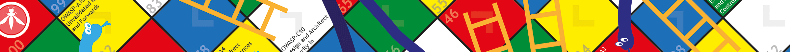

---

layout: col-sidebar
title: OWASP Snakes And Ladders
site_side: true
tags: sl
project: true
level: 3
type: documentation

---

Snakes and Ladders is an educational project. It uses gamification to promote awareness of application security controls and risks, and in particular knowledge of other OWASP documents and tools.

## Editions

*Web Applications*

In the board game for web applications, the virtuous behaviours (ladders) are secure coding practices (from [OWASP Proactive Controls Project](/www-project-proactive-controls) 2014-2018) and the vices (snakes) are application security risks (from [OWASP Top Ten Project](/www-project-top-ten) 2013-2017). See also a [mapping between these two lists](/www-project-proactive-controls/2018/OWASP_TOP_10_Proactive_Controls_2018_V3_PL.pdf).

*Mobile Apps*

The identical board game for mobile apps uses mobile controls (from the [Mobile Security Project](/www-project-mobile-security) top ten controls 2013) as the virtuous behaviours and mobile risks (the top ten mobile risks 2014 from the same project) as the vices.

## Background

This board game was created to use as an ice-breaker in application security training, but it potentially has wider appeal simply as a promotional hand-out, and maybe also more usefully as learning materials for younger coders. To cover all of that, we use the phrase "OWASP Snakes and Ladders is meant to be used by software programmers, big and small".

The game is quite lightweight, and does not have the same rigour or depth as the card game Cornucopia, but it is meant to be just some fun with some learning attached.

Print-ready PDFs have been published - these are poster sized A2 (international ISO 216 [paper size](https://en.wikipedia.org/wiki/Paper_size) 420×594mm, approximately 16.5×23.4in, with 3mm bleed and printers' marks). But the original files are in Adobe Illustrator, so these are also available for anyone to use and improve upon. We recommend playing using a real die and counters (markers), but you can cut out and make these from the paper sheet itself if you have scissor and glue skills.

We hope it may be of use in any upcoming office party, celebration, festival, seasonal event, application security awareness or training exercise. Or just to help spread the word about controls and risks at work, at college or at school. If you are training anyone about the OWASP Top Ten, OWASP Proactive Controls or the OWASP Mobile projects, please consider giving each attendee a printed copy of the game as a take away.

## Licensing

OWASP Snakes and Ladders is free to use. It is licensed under the [Creative Commons Attribution-ShareAlike 3.0 license](http://creativecommons.org/licenses/by-sa/3.0/), so you can copy, distribute and transmit the work, and you can adapt it, and use it commercially, but all provided that you attribute the work and if you alter, transform, or build upon this work, you may distribute the resulting work only under the same or similar license to this one.

© OWASP Foundation

## Other Security Gamification

If you are interested in using gaming for security, also see [OWASP Cornucopia](/www-project-cornucopia), [Elevation of Privilege: The Threat Modeling Game](http://www.microsoft.com/security/sdl/adopt/eop.aspx), [Security Cards](http://securitycards.cs.washington.edu/) from the University of Washington, the commercial card game [Control-Alt-Hack](http://www.controlalthack.com/) ([presentation](http://media.blackhat.com/bh-us-12/Briefings/Kohno/BH_US_12_Kohno_Control_Alt_Hack_Slides.pdf)), and web application security training tools incorporating gamification such as [OWASP Hackademic Challenges Project](/www-project-hackademic-challenges), [OWASP Security Shepherd](/www-project-security-shepherd) and [ITSEC Games](http://itsecgames.blogspot.co.uk/).

Additionally, Adam Shostack maintains a list of tabletop security games and related resources at [security games](http://adam.shostack.org/games.html).
