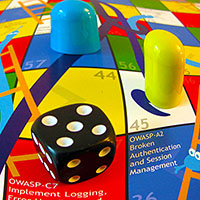

### Quick Downloads

* Web Applications
  * BR, DE, [EN](https://github.com/OWASP/www-project-snakes-and-ladders/tree/master/assets/files/EN), ES, FR, JA, TR, ZH
  * [More options...](#div-webapplications)
* Mobile Apps
  * EN, JA
  * More options...

### What is This?

* Snakes and Ladders is a popular board game, with [ancient provenance](http://en.wikipedia.org/wiki/Snakes_and_Ladders) imported into [Great Britain from Asia](http://sandradodd.com/game/snakesandladders) in the 19th century. The original game showed the effects of good and evil, or virtues and vices. This OWASP game is a poster-sized *print-your-own* paper sheet with the game board on it. Just get some players together with a die and counters. The virtues are application security controls, and the vices are risks.

### Project Information

* <i class="fas fa-flask" style="font-size: 1.2em; color:#FFA500;"></i>Lab Project
* <i class="fas fa-book" style="font-size: 1.2em; color:#233e81;"></i>Documentation
* <i class="fas fa-tools" style="font-size: 1.2em; color:#233e81;"></i>Builder 
* <i class="fas fa-shield-alt" style="font-size: 1.2em; color:#233e81;"></i>Defender

### Twitter

* 

* Follow two mock games running on Twitter:

* [@OWASPSnakesWeb](https://twitter.com/OWASPSnakesWeb)
* [@OWASPSnakesMob](https://twitter.com/OWASPSnakesMob)

### License

* 

