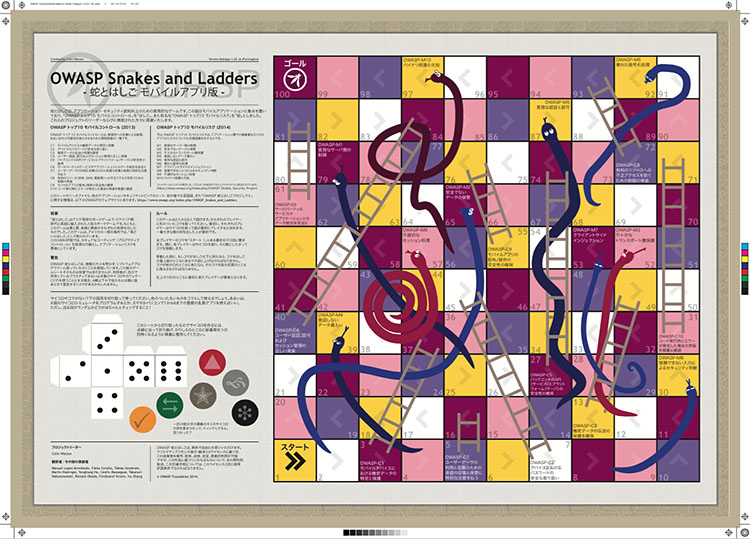
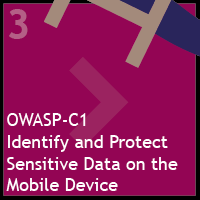
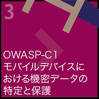
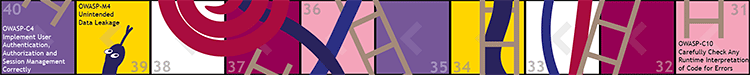

## Mobile Apps Edition

OWASP Snakes and Ladders - Mobile Apps was created after working out the idea and design for the web application version of the board game. It seemed easy to replicate the idea since the OWASP Mobile Project lists both security controls and risks. The virtuous behaviours (ladders) are mobile controls (from the Mobile Security Project Top Ten Controls 2013) and the vices (snakes) are mobile risks (from the Top Ten Mobile Risks 2014).

## Current Releases

Language Code: Name / Title / Current Version | Example Square
------------ | ------ 
[EN: English](https://github.com/OWASP/www-project-snakes-and-ladders/tree/master/assets/files/mob/EN)  Snakes and Ladders Mobile Apps | 
[JA: 日本語](https://github.com/OWASP/www-project-snakes-and-ladders/tree/master/assets/files/mob/JA)  蛇とはしご モバイルアプリ版 | 

Source: [Adobe Illustrator file](https://github.com/OWASP/www-project-snakes-and-ladders/tree/master/assets/files/mob)

### Tabletop Simulator

A digital version (of the English release) is [available on Steam Workshop](https://steamcommunity.com/sharedfiles/filedetails/?id=1969196030). It can be played with 2-6 players online. While [the game itself is a free community download](https://steamcommunity.com/sharedfiles/filedetails/?id=1969196030), all players must have [Tabletop Simulator](https://store.steampowered.com/app/286160/Tabletop_Simulator/) in their Steam library.

## Colour Scheme 'Farringdon'

Other people's versions of Snakes and Ladders [use a wide variety of designs and colour schemes](https://duckduckgo.com/?q=snakes+and+ladders+board+game&t=h_&iax=images&ia=images). Thus to make a complete contrast to the edition for web applications, the colours used are the designatory colours of the underground and mainline train services that run through Colin Watson's local station at Farringdon in Clerkenwell, London EC1. The colours in 'Farringdon' are:

* Purple (future ~~Crossrail~~ Elizabeth)
* Yellow (Circle)
* White (Thameslink)
* Maroon (Metropolitan)
* Pink (Hammersmith & City)

You can see these colours on tube maps and station signage. The start square (1) is yellow and the final square (100) is maroon.
