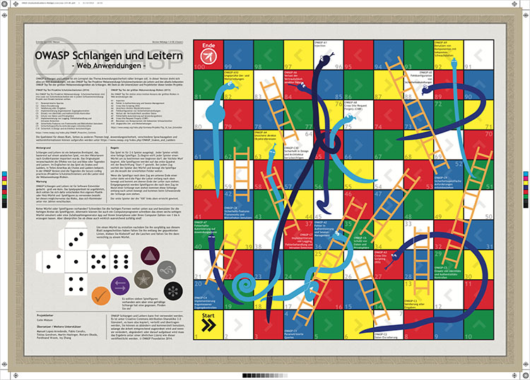
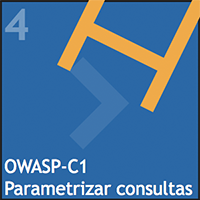
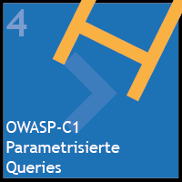
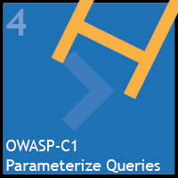
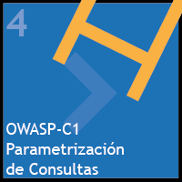
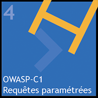
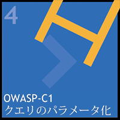
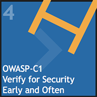
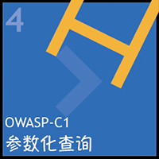
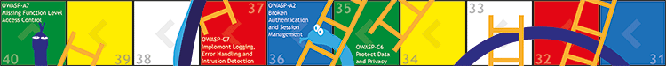

## Web Applications Edition

OWASP Snakes and Ladders - Web Applications
was the first edition created. The objective is to raise awareness
of the security controls that every web application should have, but
link that with the much more widely known Top Ten Risks. The virtuous
behaviours (ladders) are secure coding practices (from [OWASP Proactive
Controls project](/www-project-proactive-controls) 2014-2018) and
the vices (snakes) are application security risks (from [OWASP Top Ten
Project](/www-project-top-ten) 2013-2017).

## Current Releases

Language Code: Name / Title / Current Version | Example Square
------------ | ------ 
[BR: Português Brasileiro](https://github.com/OWASP/www-project-snakes-and-ladders/tree/master/assets/files/web/BR)  Serpentes e Escadas Aplicativos da Web   | 
[DE: Deutsch](https://github.com/OWASP/www-project-snakes-and-ladders/tree/master/assets/files/web/DE)  Schlangen und Leitern Web Anwendungen   | 
[EN: English](https://github.com/OWASP/www-project-snakes-and-ladders/tree/master/assets/files/web/EN)  Snakes and Ladders Web Applications   v1.20 | 
[ES: Español](https://github.com/OWASP/www-project-snakes-and-ladders/tree/master/assets/files/web/ES)  Serpientes y Escaleras Aplicaciones Web   | 
[FR: Français](https://github.com/OWASP/www-project-snakes-and-ladders/tree/master/assets/files/web/FR)  Serpents et Échelles Application Web   | 
[JA: 日本語](https://github.com/OWASP/www-project-snakes-and-ladders/tree/master/assets/files/web/JA)  蛇とはしご ウェブアプリケーション   | 
[TR: Türkçe](https://github.com/OWASP/www-project-snakes-and-ladders/tree/master/assets/files/web/TR)  Yılanlar ve Merdivenler Web Uygulamaları   | 
[ZH: 中文](https://github.com/OWASP/www-project-snakes-and-ladders/tree/master/assets/files/web/ZH)   蛇梯棋 WEB应用程序   | 

Note that some languages choose not to change the EN text for risk and control names.

Source: [Adobe Illustrator file](https://github.com/OWASP/www-project-snakes-and-ladders/tree/master/assets/files/web)

### Tabletop Simulator

A digital version (of the English release) is [available on Steam Workshop](https://steamcommunity.com/sharedfiles/filedetails/?id=1969196030). It can be played with 2-6 players online. While [the game itself is a free community download](https://steamcommunity.com/sharedfiles/filedetails/?id=1969196030), all players must have [Tabletop Simulator](https://store.steampowered.com/app/286160/Tabletop_Simulator/) in their Steam library.

## Colour Scheme 'Classic'

This edition uses simple primary colours, like many versions that can be seen in pictures of Snakes and Ladders games. The colours used in 'Classic' are:

* Green
* Yellow
* White
* Red
* Blue

The start square (1) is yellow and the final square (100) is red.